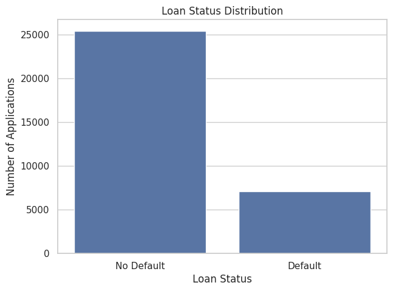
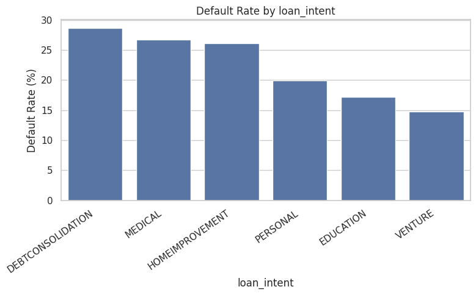
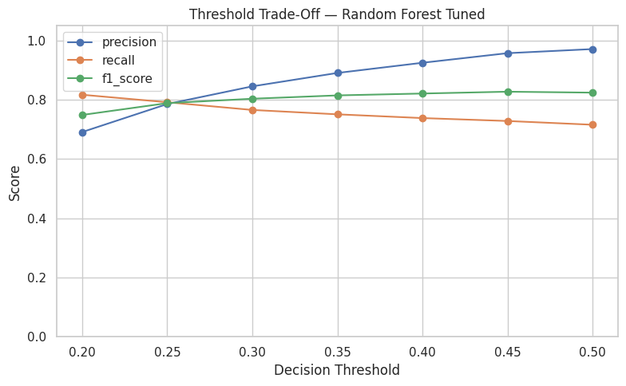
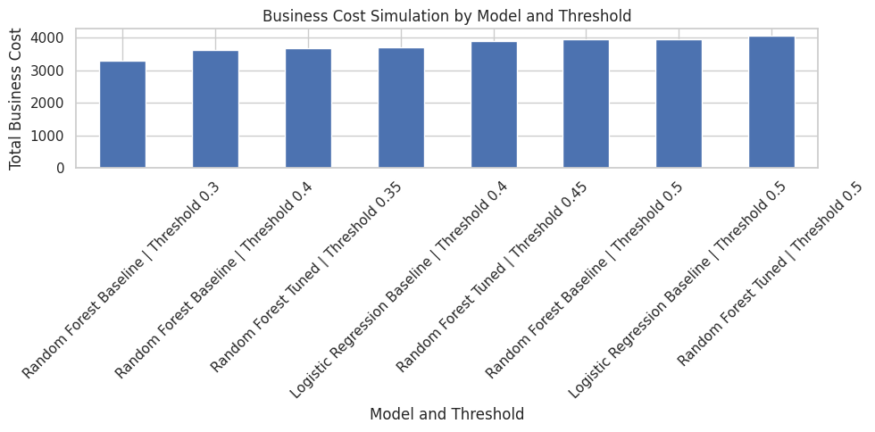
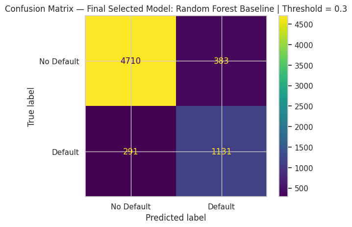
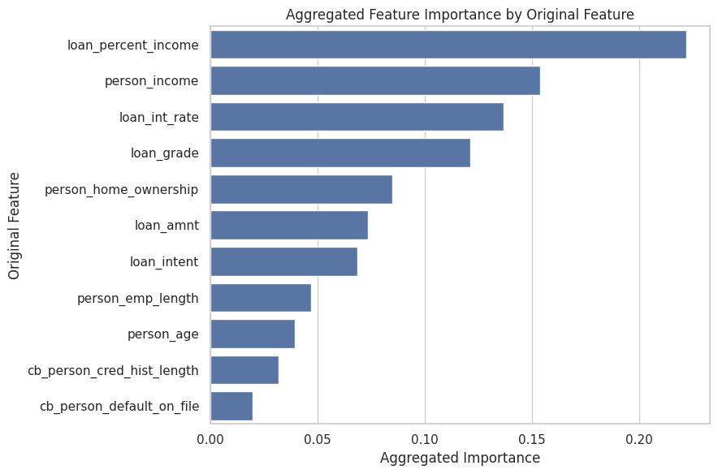

# Credit Risk Analysis and Prediction Using Machine Learning

## Cost-Sensitive Loan Default Prediction for Risk-Based Lending Decisions

This project develops a machine learning solution to predict loan default risk using borrower, loan, and credit-history data.

The project is framed as a **credit-risk decision-support system**, not as an automatic loan rejection tool. It focuses on predictive performance, threshold optimization, business cost simulation, model interpretation, and responsible AI considerations.

---

## Project Overview

Financial institutions such as banks, fintech lenders, and credit providers face an important challenge when issuing loans:

> How can a lender identify high-risk loan applicants before approval while avoiding unnecessary rejection of potentially good borrowers?

A loan default prediction model can support this decision by estimating the probability that a borrower may default. However, in credit-risk modeling, accuracy alone is not enough. A model must also consider the business consequences of prediction errors.

This project treats loan default prediction as a **cost-sensitive binary classification problem**.

---

## Business Problem

The model predicts whether a loan applicant is likely to default.

Target variable:

| Target | Meaning    |
| -----: | ---------- |
|    `0` | No Default |
|    `1` | Default    |

In this project, two types of errors are especially important:

| Error Type     | Meaning                                          | Business Impact                                 |
| -------------- | ------------------------------------------------ | ----------------------------------------------- |
| False Negative | Borrower is predicted safe but actually defaults | High financial loss                             |
| False Positive | Borrower is predicted risky but would repay      | Lost business opportunity or manual-review cost |

Because missed defaulters are usually more costly than unnecessary reviews, the final model is selected using both statistical metrics and a business cost simulation.

---

## Dataset

The project uses the **Credit Risk Dataset** from Kaggle.

Dataset source:

* Kaggle Credit Risk Dataset
* Dataset URL: `https://www.kaggle.com/datasets/laotse/credit-risk-dataset`

The raw dataset is not included in this repository. The notebook downloads the dataset directly from Kaggle using the `opendatasets` library.

Main feature groups:

| Feature Group            | Example Features                                    |
| ------------------------ | --------------------------------------------------- |
| Borrower characteristics | age, income, employment length, home ownership      |
| Loan characteristics     | loan amount, interest rate, loan intent, loan grade |
| Credit history           | previous default history, credit history length     |
| Target variable          | loan default status                                 |

---

## Repository Structure

```text
credit-risk-analysis-and-prediction/
│
├── README.md
├── requirements.txt
├── .gitignore

├── data/
│   └── README.md
│
├── docs/
│   └── project_overview.md
│
├── images/
│   ├── target_distribution.png
│   ├── categorical_default_risk.png
│   ├── threshold_tradeoff_random_forest.png
│   ├── business_cost_simulation.png
│   ├── final_model_confusion_matrix.png
│   └── feature_importance.png
│
├── notebooks/
│   └── credit_risk_analysis_and_prediction.ipynb
│
└── reports/
    └── credit_risk_analysis_and_prediction_full_project_report.pdf
```

---

## Project Workflow

The notebook follows a complete end-to-end machine learning workflow:

1. Business problem framing
2. Dataset loading and understanding
3. Exploratory data analysis
4. Missing value assessment and treatment
5. Outlier policy and data-quality corrections
6. Feature engineering and preprocessing
7. Stratified train-test split
8. Logistic Regression baseline model
9. Random Forest baseline model
10. Cross-validation
11. Hyperparameter tuning
12. Threshold analysis
13. Business cost simulation
14. Final model selection
15. Model interpretation
16. Responsible AI and subgroup diagnostic
17. Final business recommendations

---
---

## Visual Project Highlights

The project includes several visual outputs to support both technical evaluation and business interpretation.

### Target Distribution

The dataset is imbalanced, with non-default cases representing the majority class and default cases representing the minority class.



---

### Categorical Default Risk Patterns

Default risk differs across categorical borrower and loan characteristics. Loan grade, loan intent, home ownership, and previous default history show important risk patterns.



---

### Random Forest Threshold Trade-Off

Threshold analysis shows how changing the decision threshold affects precision, recall, and F1-score. This is important because credit-risk models should not rely only on the default 0.50 threshold.



---

### Business Cost Simulation

The business cost simulation compares different model-threshold combinations using assumed false-negative and false-positive costs. This analysis supports the final model selection.



---

### Final Selected Model Confusion Matrix

The final selected model is the Random Forest baseline model at a threshold of 0.30. The confusion matrix shows the trade-off between correctly detected defaulters, missed defaulters, false alarms, and correctly identified non-defaulters.



---

### Feature Importance

Feature importance analysis shows that the model is mainly driven by borrower affordability, income, interest rate, loan grade, and housing profile.



---


## Data Quality and Preprocessing

The project includes a documented data-quality workflow.

Key preprocessing steps:

* Missing value assessment
* Missing value indicator creation
* Median imputation for employment length
* Loan-grade-based imputation for missing interest rates
* Outlier policy for unrealistic age values
* Employment-length correction using age-based logic
* Income capping at the 99th percentile
* Recalculation of loan percent income
* One-hot encoding for categorical variables
* Standard scaling for Logistic Regression
* Tree-based preprocessing for Random Forest

Final cleaned modeling dataset:

| Item                          |        Result |
| ----------------------------- | ------------: |
| Rows                          |        32,574 |
| Features before encoding      |            13 |
| Target variable               | `loan_status` |
| Missing values after cleaning |             0 |

---

## Exploratory Data Analysis Highlights

The EDA showed clear credit-risk patterns.

Important findings:

* Borrowers with higher `loan_percent_income` showed higher default risk.
* Defaulted borrowers had lower median income than non-defaulted borrowers.
* Defaulted borrowers had higher median interest rates.
* Loan grade showed a strong risk gradient.
* Previous default history was associated with higher default rates.
* Renters showed higher default rates than borrowers with home ownership or mortgage status.
* Some loan purposes, such as debt consolidation and medical loans, showed higher default risk.

These findings guided preprocessing, modeling, and interpretation.

---

## Models Used

The project compares multiple models and thresholds:

| Model                  | Purpose                                |
| ---------------------- | -------------------------------------- |
| Logistic Regression    | Interpretable baseline model           |
| Random Forest Baseline | Non-linear advanced model              |
| Tuned Random Forest    | Hyperparameter-optimized Random Forest |

Evaluation metrics:

* Accuracy
* Precision
* Recall
* F1-score
* ROC-AUC
* PR-AUC
* Confusion matrix
* False positives
* False negatives
* Business cost simulation

---

## Model Comparison

At the default threshold of 0.50, the main model comparison was:

| Model                        | Accuracy | Precision | Recall | F1-score | ROC-AUC | PR-AUC | False Positives | False Negatives |
| ---------------------------- | -------: | --------: | -----: | -------: | ------: | -----: | --------------: | --------------: |
| Logistic Regression Baseline |   0.8083 |    0.5418 | 0.7883 |   0.6422 |  0.8710 | 0.7165 |             948 |             301 |
| Random Forest Baseline       |   0.9308 |    0.9426 | 0.7271 |   0.8210 |  0.9305 | 0.8810 |              63 |             388 |
| Random Forest Tuned          |   0.9334 |    0.9714 | 0.7159 |   0.8243 |  0.9267 | 0.8781 |              30 |             404 |

The tuned Random Forest achieved the highest precision and slightly highest F1-score at threshold 0.50. However, it missed more actual defaulters than the Random Forest baseline.

Because false negatives are expensive in credit-risk settings, threshold analysis and business cost simulation were used for final model selection.

---

## Final Selected Model

The final selected model is:

| Item               | Final Choice                 |
| ------------------ | ---------------------------- |
| Model              | Random Forest Baseline       |
| Decision threshold | 0.30                         |
| Selection method   | Business cost simulation     |
| Intended use       | Credit-risk decision support |

Final selected model performance:

| Metric          | Result |
| --------------- | -----: |
| Accuracy        | 0.8985 |
| Precision       | 0.7470 |
| Recall          | 0.7954 |
| F1-score        | 0.7704 |
| ROC-AUC         | 0.9305 |
| PR-AUC          | 0.8810 |
| False Positives |    383 |
| False Negatives |    291 |
| True Positives  |  1,131 |
| True Negatives  |  4,710 |

The selected threshold improves default detection compared with the default 0.50 threshold and provides better business value under the assumed cost structure.

---

## Business Cost Simulation

The project uses a simplified cost simulation with the following assumptions:

| Error Type     |  Assumed Cost |
| -------------- | ------------: |
| False Negative | 10 cost units |
| False Positive |   1 cost unit |

No-model baseline:

| Scenario              | Total Business Cost |
| --------------------- | ------------------: |
| Approve all borrowers |              14,220 |

Final selected model:

| Scenario                                 | Total Business Cost |
| ---------------------------------------- | ------------------: |
| Random Forest Baseline at threshold 0.30 |               3,293 |

Business impact:

| Metric                                |            Result |
| ------------------------------------- | ----------------: |
| Cost saved vs approving all borrowers | 10,927 cost units |
| Cost reduction                        |            76.84% |

This demonstrates that the model can provide meaningful business value when evaluated using cost-sensitive decision logic.

---

## Model Interpretation

Feature importance analysis showed that the final model is mainly driven by borrower affordability, income, interest rate, loan grade, and housing profile.

Top original feature drivers:

| Rank | Feature                 |
| ---: | ----------------------- |
|    1 | `loan_percent_income`   |
|    2 | `person_income`         |
|    3 | `loan_int_rate`         |
|    4 | `loan_grade`            |
|    5 | `person_home_ownership` |

The strongest feature, `loan_percent_income`, confirms that borrower affordability is a central driver of default risk.

---

## Responsible AI Considerations

Credit-risk modeling is a high-impact use case because model predictions may influence access to financial services.

This project includes responsible AI considerations such as:

* Human-in-the-loop decision support
* Avoiding fully automated rejection
* Subgroup performance diagnostics
* Discussion of proxy variables
* Threshold impact review
* Model limitation documentation
* Recommendation for future fairness audits

Important note:

The dataset does not include protected attributes such as race, ethnicity, religion, disability status, or gender. Therefore, a full fairness audit cannot be performed. However, the absence of protected attributes does not guarantee fairness because other variables may act as proxies for socioeconomic conditions.

---

## Recommended Business Use

The model should be used as a **decision-support tool**, not as a fully automated credit decision system.

A practical workflow could use predicted default probability bands:

| Risk Band                            | Suggested Action                                  |
| ------------------------------------ | ------------------------------------------------- |
| Low predicted default probability    | Standard approval review                          |
| Medium predicted default probability | Manual credit-risk review                         |
| High predicted default probability   | Enhanced underwriting or additional documentation |

This approach balances risk reduction with responsible human oversight.

---

## Limitations

Key limitations:

1. The dataset is publicly available and may not fully represent real-world lending complexity.
2. Protected demographic attributes are not available, so a full fairness audit is not possible.
3. The cost simulation uses simplified hypothetical cost assumptions.
4. Random Forest feature importance explains global model behavior but not individual decisions.
5. The notebook does not include production deployment, model monitoring, or drift detection.
6. The model should not be used for real lending decisions without validation, compliance review, and governance.

---

## Future Improvements

Possible future improvements:

* Test additional models such as XGBoost or LightGBM.
* Add SHAP explainability for local and global model interpretation.
* Run sensitivity analysis with different false-positive and false-negative cost ratios.
* Add probability calibration analysis.
* Build a probability-band decision framework.
* Perform deeper fairness analysis if protected or proxy-sensitive variables are available.
* Build a dashboard for monitoring credit-risk predictions and subgroup performance.
* Add model drift monitoring for production-style deployment.

---

## Tools and Libraries

Main tools used:

* Python
* pandas
* NumPy
* matplotlib
* seaborn
* scikit-learn
* opendatasets
* Google Colab
* Jupyter Notebook

---

## How to Run the Project

1. Clone the repository.

```bash
git clone https://github.com/YOUR-USERNAME/credit-risk-analysis-and-prediction.git
```

2. Install dependencies.

```bash
pip install -r requirements.txt
```

3. Open the notebook.

```text
notebooks/credit_risk_analysis_and_prediction.ipynb
```

4. Run all cells.

The notebook downloads the dataset from Kaggle using `opendatasets`. Kaggle authentication may be required.

---

## Project Files

| File                                                                  | Description                     |
| --------------------------------------------------------------------- | ------------------------------- |
| `notebooks/credit_risk_analysis_and_prediction.ipynb`                 | Full project notebook           |
| `reports/credit_risk_analysis_and_prediction_full_project_report.pdf` | PDF version of the full project |
| `docs/project_overview.md`                                            | Short project overview          |
| `data/README.md`                                                      | Dataset source and usage notes  |
| `requirements.txt`                                                    | Python dependencies             |
| `images/`                                                             | Selected visual outputs         |

---

## Author

**Mahdi Dadgar**
Data Analytics | Business Intelligence | Machine Learning | Data Science | AI

GitHub: `mahdidadgar-data`

---

## Disclaimer

This project is for educational and portfolio purposes only.

The model is not intended for real-world lending decisions without further validation, compliance review, fairness auditing, governance, and monitoring.
# Credit Risk Analysis and Prediction Using Machine Learning

## Cost-Sensitive Loan Default Prediction for Risk-Based Lending Decisions

This project develops a machine learning solution to predict loan default risk using borrower, loan, and credit-history data.

The project is framed as a **credit-risk decision-support system**, not as an automatic loan rejection tool. It focuses on predictive performance, threshold optimization, business cost simulation, model interpretation, and responsible AI considerations.

---

## Project Overview

Financial institutions such as banks, fintech lenders, and credit providers face an important challenge when issuing loans:

> How can a lender identify high-risk loan applicants before approval while avoiding unnecessary rejection of potentially good borrowers?

A loan default prediction model can support this decision by estimating the probability that a borrower may default. However, in credit-risk modeling, accuracy alone is not enough. A model must also consider the business consequences of prediction errors.

This project treats loan default prediction as a **cost-sensitive binary classification problem**.

---

## Business Problem

The model predicts whether a loan applicant is likely to default.

Target variable:

| Target | Meaning    |
| -----: | ---------- |
|    `0` | No Default |
|    `1` | Default    |

In this project, two types of errors are especially important:

| Error Type     | Meaning                                          | Business Impact                                 |
| -------------- | ------------------------------------------------ | ----------------------------------------------- |
| False Negative | Borrower is predicted safe but actually defaults | High financial loss                             |
| False Positive | Borrower is predicted risky but would repay      | Lost business opportunity or manual-review cost |

Because missed defaulters are usually more costly than unnecessary reviews, the final model is selected using both statistical metrics and a business cost simulation.

---

## Dataset

The project uses the **Credit Risk Dataset** from Kaggle.

Dataset source:

* Kaggle Credit Risk Dataset
* Dataset URL: `https://www.kaggle.com/datasets/laotse/credit-risk-dataset`

The raw dataset is not included in this repository. The notebook downloads the dataset directly from Kaggle using the `opendatasets` library.

Main feature groups:

| Feature Group            | Example Features                                    |
| ------------------------ | --------------------------------------------------- |
| Borrower characteristics | age, income, employment length, home ownership      |
| Loan characteristics     | loan amount, interest rate, loan intent, loan grade |
| Credit history           | previous default history, credit history length     |
| Target variable          | loan default status                                 |

---

## Repository Structure

```text
credit-risk-analysis-and-prediction/
│
├── README.md
├── requirements.txt
│
├── data/
│   └── README.md
│
├── docs/
│   └── project_overview.md
│
├── images/
│   └── selected charts and screenshots
│
├── notebooks/
│   └── credit_risk_analysis_and_prediction.ipynb
│
└── reports/
    └── credit_risk_analysis_and_prediction_full_project_report.pdf
```

---

## Project Workflow

The notebook follows a complete end-to-end machine learning workflow:

1. Business problem framing
2. Dataset loading and understanding
3. Exploratory data analysis
4. Missing value assessment and treatment
5. Outlier policy and data-quality corrections
6. Feature engineering and preprocessing
7. Stratified train-test split
8. Logistic Regression baseline model
9. Random Forest baseline model
10. Cross-validation
11. Hyperparameter tuning
12. Threshold analysis
13. Business cost simulation
14. Final model selection
15. Model interpretation
16. Responsible AI and subgroup diagnostic
17. Final business recommendations

---

## Data Quality and Preprocessing

The project includes a documented data-quality workflow.

Key preprocessing steps:

* Missing value assessment
* Missing value indicator creation
* Median imputation for employment length
* Loan-grade-based imputation for missing interest rates
* Outlier policy for unrealistic age values
* Employment-length correction using age-based logic
* Income capping at the 99th percentile
* Recalculation of loan percent income
* One-hot encoding for categorical variables
* Standard scaling for Logistic Regression
* Tree-based preprocessing for Random Forest

Final cleaned modeling dataset:

| Item                          |        Result |
| ----------------------------- | ------------: |
| Rows                          |        32,574 |
| Features before encoding      |            13 |
| Target variable               | `loan_status` |
| Missing values after cleaning |             0 |

---

## Exploratory Data Analysis Highlights

The EDA showed clear credit-risk patterns.

Important findings:

* Borrowers with higher `loan_percent_income` showed higher default risk.
* Defaulted borrowers had lower median income than non-defaulted borrowers.
* Defaulted borrowers had higher median interest rates.
* Loan grade showed a strong risk gradient.
* Previous default history was associated with higher default rates.
* Renters showed higher default rates than borrowers with home ownership or mortgage status.
* Some loan purposes, such as debt consolidation and medical loans, showed higher default risk.

These findings guided preprocessing, modeling, and interpretation.

---

## Models Used

The project compares multiple models and thresholds:

| Model                  | Purpose                                |
| ---------------------- | -------------------------------------- |
| Logistic Regression    | Interpretable baseline model           |
| Random Forest Baseline | Non-linear advanced model              |
| Tuned Random Forest    | Hyperparameter-optimized Random Forest |

Evaluation metrics:

* Accuracy
* Precision
* Recall
* F1-score
* ROC-AUC
* PR-AUC
* Confusion matrix
* False positives
* False negatives
* Business cost simulation

---

## Model Comparison

At the default threshold of 0.50, the main model comparison was:

| Model                        | Accuracy | Precision | Recall | F1-score | ROC-AUC | PR-AUC | False Positives | False Negatives |
| ---------------------------- | -------: | --------: | -----: | -------: | ------: | -----: | --------------: | --------------: |
| Logistic Regression Baseline |   0.8083 |    0.5418 | 0.7883 |   0.6422 |  0.8710 | 0.7165 |             948 |             301 |
| Random Forest Baseline       |   0.9308 |    0.9426 | 0.7271 |   0.8210 |  0.9305 | 0.8810 |              63 |             388 |
| Random Forest Tuned          |   0.9334 |    0.9714 | 0.7159 |   0.8243 |  0.9267 | 0.8781 |              30 |             404 |

The tuned Random Forest achieved the highest precision and slightly highest F1-score at threshold 0.50. However, it missed more actual defaulters than the Random Forest baseline.

Because false negatives are expensive in credit-risk settings, threshold analysis and business cost simulation were used for final model selection.

---

## Final Selected Model

The final selected model is:

| Item               | Final Choice                 |
| ------------------ | ---------------------------- |
| Model              | Random Forest Baseline       |
| Decision threshold | 0.30                         |
| Selection method   | Business cost simulation     |
| Intended use       | Credit-risk decision support |

Final selected model performance:

| Metric          | Result |
| --------------- | -----: |
| Accuracy        | 0.8985 |
| Precision       | 0.7470 |
| Recall          | 0.7954 |
| F1-score        | 0.7704 |
| ROC-AUC         | 0.9305 |
| PR-AUC          | 0.8810 |
| False Positives |    383 |
| False Negatives |    291 |
| True Positives  |  1,131 |
| True Negatives  |  4,710 |

The selected threshold improves default detection compared with the default 0.50 threshold and provides better business value under the assumed cost structure.

---

## Business Cost Simulation

The project uses a simplified cost simulation with the following assumptions:

| Error Type     |  Assumed Cost |
| -------------- | ------------: |
| False Negative | 10 cost units |
| False Positive |   1 cost unit |

No-model baseline:

| Scenario              | Total Business Cost |
| --------------------- | ------------------: |
| Approve all borrowers |              14,220 |

Final selected model:

| Scenario                                 | Total Business Cost |
| ---------------------------------------- | ------------------: |
| Random Forest Baseline at threshold 0.30 |               3,293 |

Business impact:

| Metric                                |            Result |
| ------------------------------------- | ----------------: |
| Cost saved vs approving all borrowers | 10,927 cost units |
| Cost reduction                        |            76.84% |

This demonstrates that the model can provide meaningful business value when evaluated using cost-sensitive decision logic.

---

## Model Interpretation

Feature importance analysis showed that the final model is mainly driven by borrower affordability, income, interest rate, loan grade, and housing profile.

Top original feature drivers:

| Rank | Feature                 |
| ---: | ----------------------- |
|    1 | `loan_percent_income`   |
|    2 | `person_income`         |
|    3 | `loan_int_rate`         |
|    4 | `loan_grade`            |
|    5 | `person_home_ownership` |

The strongest feature, `loan_percent_income`, confirms that borrower affordability is a central driver of default risk.

---

## Responsible AI Considerations

Credit-risk modeling is a high-impact use case because model predictions may influence access to financial services.

This project includes responsible AI considerations such as:

* Human-in-the-loop decision support
* Avoiding fully automated rejection
* Subgroup performance diagnostics
* Discussion of proxy variables
* Threshold impact review
* Model limitation documentation
* Recommendation for future fairness audits

Important note:

The dataset does not include protected attributes such as race, ethnicity, religion, disability status, or gender. Therefore, a full fairness audit cannot be performed. However, the absence of protected attributes does not guarantee fairness because other variables may act as proxies for socioeconomic conditions.

---

## Recommended Business Use

The model should be used as a **decision-support tool**, not as a fully automated credit decision system.

A practical workflow could use predicted default probability bands:

| Risk Band                            | Suggested Action                                  |
| ------------------------------------ | ------------------------------------------------- |
| Low predicted default probability    | Standard approval review                          |
| Medium predicted default probability | Manual credit-risk review                         |
| High predicted default probability   | Enhanced underwriting or additional documentation |

This approach balances risk reduction with responsible human oversight.

---

## Limitations

Key limitations:

1. The dataset is publicly available and may not fully represent real-world lending complexity.
2. Protected demographic attributes are not available, so a full fairness audit is not possible.
3. The cost simulation uses simplified hypothetical cost assumptions.
4. Random Forest feature importance explains global model behavior but not individual decisions.
5. The notebook does not include production deployment, model monitoring, or drift detection.
6. The model should not be used for real lending decisions without validation, compliance review, and governance.

---

## Future Improvements

Possible future improvements:

* Test additional models such as XGBoost or LightGBM.
* Add SHAP explainability for local and global model interpretation.
* Run sensitivity analysis with different false-positive and false-negative cost ratios.
* Add probability calibration analysis.
* Build a probability-band decision framework.
* Perform deeper fairness analysis if protected or proxy-sensitive variables are available.
* Build a dashboard for monitoring credit-risk predictions and subgroup performance.
* Add model drift monitoring for production-style deployment.

---

## Tools and Libraries

Main tools used:

* Python
* pandas
* NumPy
* matplotlib
* seaborn
* scikit-learn
* opendatasets
* Google Colab
* Jupyter Notebook

---

## How to Run the Project

1. Clone the repository.

```bash
git clone https://github.com/YOUR-USERNAME/credit-risk-analysis-and-prediction.git
```

2. Install dependencies.

```bash
pip install -r requirements.txt
```

3. Open the notebook.

```text
notebooks/credit_risk_analysis_and_prediction.ipynb
```

4. Run all cells.

The notebook downloads the dataset from Kaggle using `opendatasets`. Kaggle authentication may be required.

---

## Project Files

| File                                                                  | Description                     |
| --------------------------------------------------------------------- | ------------------------------- |
| `notebooks/credit_risk_analysis_and_prediction.ipynb`                 | Full project notebook           |
| `reports/credit_risk_analysis_and_prediction_full_project_report.pdf` | PDF version of the full project |
| `docs/project_overview.md`                                            | Short project overview          |
| `data/README.md`                                                      | Dataset source and usage notes  |
| `requirements.txt`                                                    | Python dependencies             |
| `images/`                                                             | Selected visual outputs         |

---

## Author

**Mahdi Dadgar**
Data Analytics | Business Intelligence | Machine Learning | Data Science | AI

GitHub: `mahdidadgar-data`

---

## Disclaimer

This project is for educational and portfolio purposes only.

The model is not intended for real-world lending decisions without further validation, compliance review, fairness auditing, governance, and monitoring.
